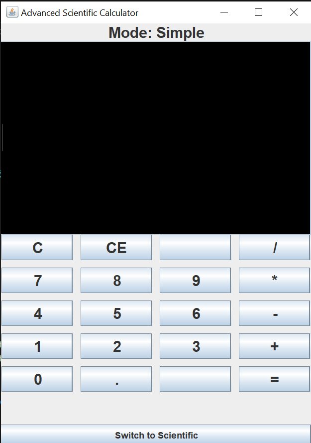
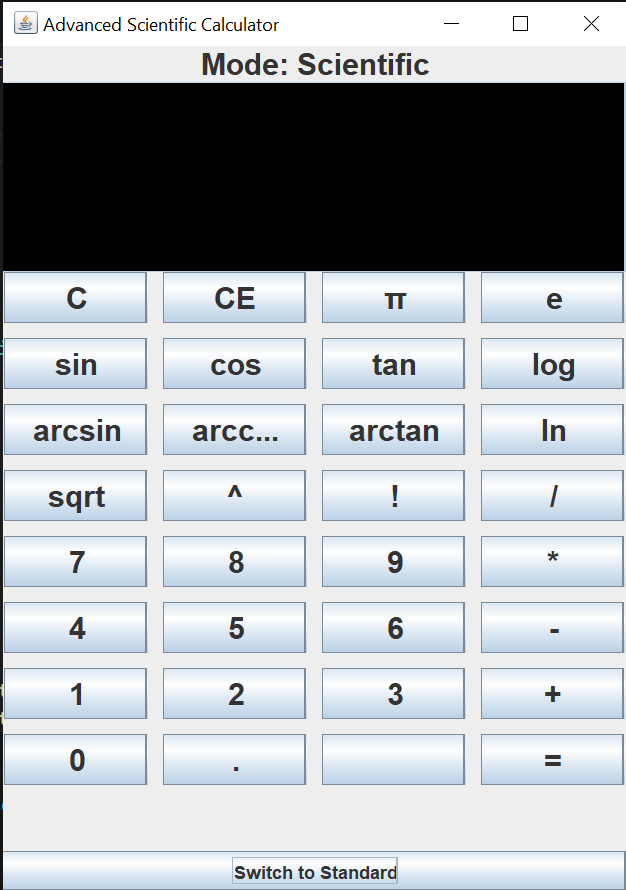

# ScientificCalculator
A **Java-based GUI scientific calculator** with both standard and scientific modes.  
Built using **Java Swing**, it supports arithmetic operations, trigonometric functions, logarithms, factorial, roots, powers, and constants like π and e.

## Features

- Standard arithmetic: `+`, `-`, `*`, `/`, `^`
- Scientific functions: `sin`, `cos`, `tan`, `arcsin`, `arccos`, `arctan`, `sqrt`, `log`, `ln`, factorial `!`
- Constants: `π`, `e`
- Toggle between **Standard** and **Scientific** modes
- Clear (`C`) and Backspace (`CE`) functionality
- User-friendly GUI with dynamic display

## Screenshots

*(You can create screenshots of your running calculator and save them in a `screenshots` folder.)*

## Author
Fatima Habib
